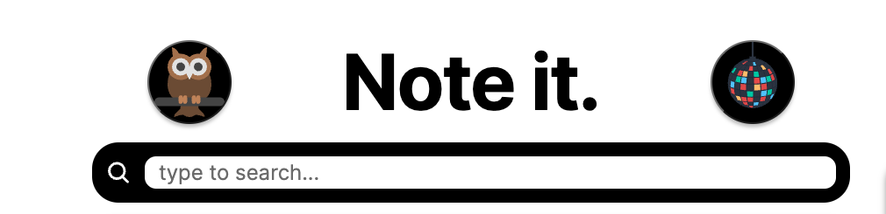
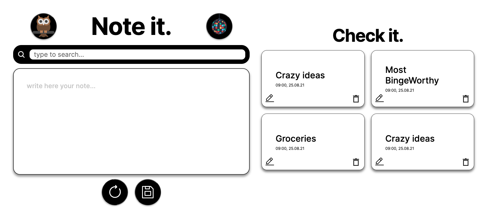
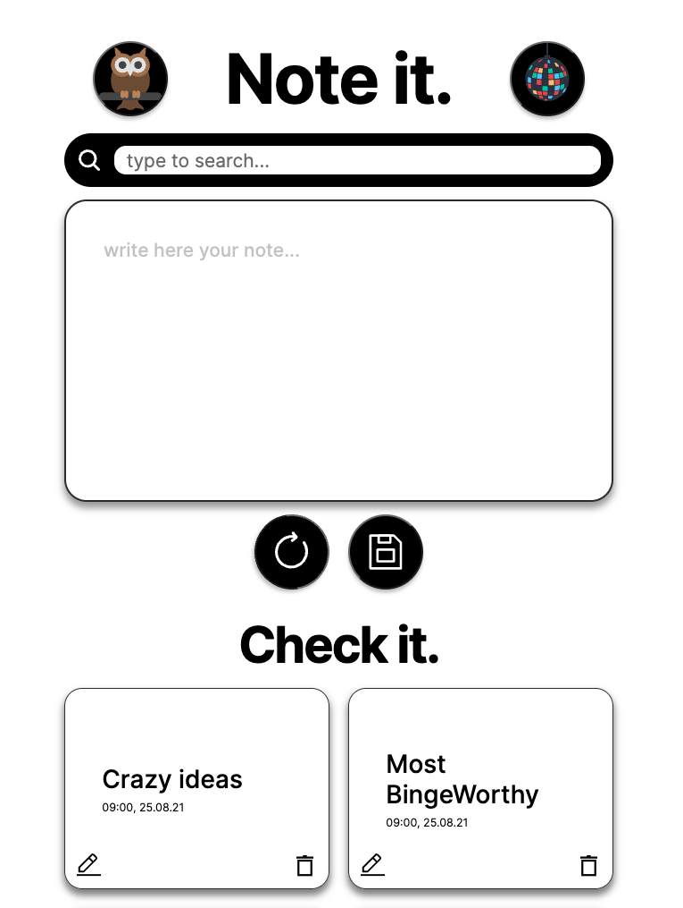
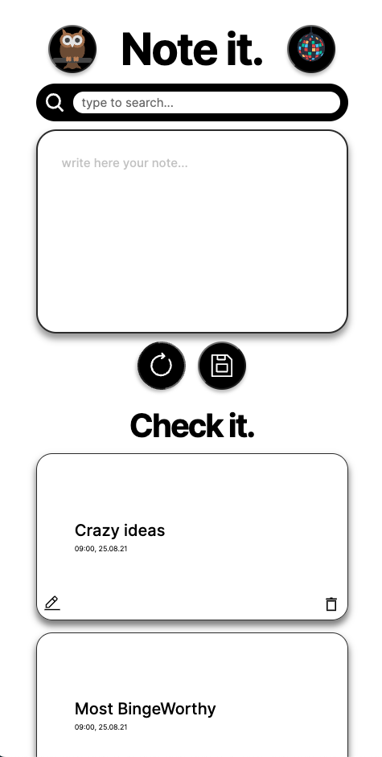

<h1>

[Visit the website](https://sage-crisp-5daf9b.netlify.app 'check the website ')

</h1>
<div>

Note it is a note app, where to user can easily take notes with self-made wireframes using Figam &
toggle feature to change the theme of the app. Feel free to scroll, and check the highlight of my code 😉 [ Click to visit the website](http://sage-crisp-5daf9b.netlify.app 'VIsit the website')

</div>

  <h2>Table of Contents</h2>

- [🧐 How to install?](#-how-to-install)
- [🦋 Inspiration](#-inspiration)
- [🎨 Check my wireframe in Figma](#-check-my-wireframe-in-figma)
- [🤓 Highlight of code snippets \& Screenshots](#-highlight-of-code-snippets--screenshots)
- [🌪️ Built with](#️-built-with)
- [🙇 What I learned](#-what-i-learned)
- [🙆 Continued development](#-continued-development)
- [💆 Useful resources](#-useful-resources)
- [👀 Author](#-author)

### 🧐 How to install?

```
npm install
npm i nanoid
```

<hr>

### 🦋 Inspiration

**THE IDEA:** I consider a note app for the most essential skills for a developer, where you store, add, remove and filter from certain information.

**THE UX/UI INSPIRATION:** The app is inspired by the black & white clean and minimal layout. To make it more interesting for the user, I added two themes: dark theme & party theme to make the ux more individually

<hr>

### 🎨 Check my wireframe in Figma

<h4> ➡️ Duplicate my wireframe and clone my App, I would love to see your result:)</h4>

<a href="https://www.figma.com/file/nMy5K9G6IpVROuhCtDenNz/note_it-(Repo)?node-id=0%3A1&t=BCeTSXEBppTjUkFs-1" target="blank">Click here to check my Figma</a>

---

### 🤓 Highlight of code snippets & Screenshots

<h3>Editing properties in the SVG selector</h3>

  <details>

```
   <svg
        xmlns="http://www.w3.org/2000/svg"
        <!-- use none to make the fill transparent -->
        fill="none"
        viewBox="0 0 24 24"
        <!-- use stroke width property to edit the line of the search icon -->
        strokeWidth={2.5}
        stroke="currentColor"
        className="search-icon"
      >
        <path
          strokeLinecap="round"
          strokeLinejoin="round"
          d="M21 21l-5.197-5.197m0 0A7.5 7.5 0 105.196 5.196a7.5 7.5 0 0010.607 10.607z"
        />
      </svg>
```

</details> <br>

<h3>Responsiveness of the website</h3>

<details>

<h4>wide screen</h4>



<h4>medium & small screen device</h4>

<div align="center">


</div>

<p>Using two media queries sizes for medium and small screen. the goal is to make it responsive in the main code, 
and make small changes to maximize the ux. In addition using the REM units to edit easily the size of components in the app</p>

```
/* ===================== MEDIA QUERIES (MEDIUM DEVICES) =========================*/
@media screen and (max-width: 1300px) {
  <!-- change the font-site in the universal selector,
  wil adapt all the css in relation with the new font size -->
  * {
    font-size: 14px;
  }

<!-- Change layout direction on the flexbox to adjust the appearance of
the app for the medium, screen devices -->
  .App {
    width: 100%;
    flex-direction: column;
    align-items: center;
  }

  .container-edit,
  .container-logs {
    width: 80%;
  }

  .container-logs {
    margin-block-start: 2rem;
  }
}

/* ===================== SMALL QUERIES (MEDIUM DEVICES) =========================*/
@media screen and (max-width: 600px) {
  * {
    font-size: 10px;
  }
}

```

</details><br>

<h3>Mapping method</h3>

<details>

<p>Using the mapping js method outside the return section for clear section divided by logic and actual render</p>

```
 const NotesList = (props) => {

  const notesMapping = props.notes.map((el) => (
    <SingleNote
      id={el.id}
      key={el.id}
      headline={el.headline}
      text={el.text}
      timeStamp={el.timeStamp}
      handleDeleteNote={props.handleDeleteNote}
    />
  ));

  return <div className="container-logs--logs-collection">{notesMapping}</div>;
};

export default NotesList;

```

</details>

<hr>

### 🌪️ Built with

- Semantic HTML5 markup
- CSS custom properties
- CSS Flexbox
- CSS Grid
- React.js
- JavaScript

<hr>

### 🙇 What I learned

- How to make a website responsive with small changes using grid, flex & media query and changing the font size in the universal selector.
- How to edit the code of the SVG selectors.
- How to create more then one toggle, using the state and conditional class names

<hr>

### 🙆 Continued development

- Use localStorage to store the data also after refreshing the page
- Adding the edit feature to update a stored information
- Adding a flip card, where the user can add some more content to each note
- Add some more styling to the new Themes by adding css variables and target those in the themes features
- Export the index.css to short css files for more clarity
-

<hr>

### 💆 Useful resources

- [SVG ](https://youtu.be/ZJSCl6XEdP8) - This helped me to understand and edit the SVG selectors. I really recommend in general about Kevin Powell's content.
- [Toggle feature](https://youtu.be/1Io-qb45nzw) - This tutorial helped me with the logic of controlling the class names using conditional rendering. short and easy to follow.

<hr>

### 👀 Author

- LinkedIn - [@thaler_mo](https://www.linkedin.com/in/moran-thaler/)
